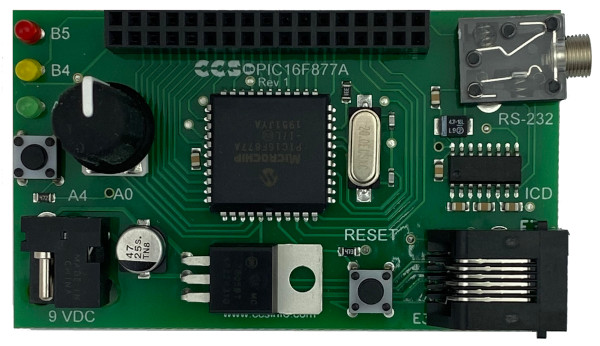
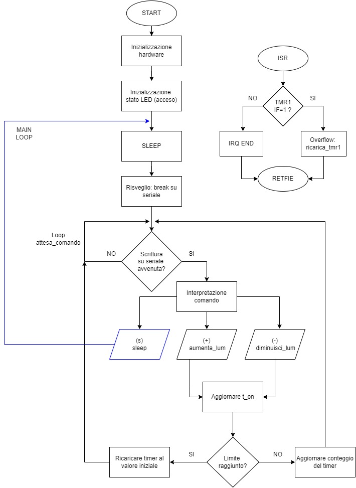

# Progetto-Sistemi-Elettronici &#x1F50C;

## Obiettivo
Sviluppo di un firmware che permette di regolare la luminosità dei LED di una scheda, ricevendo dei comandi inseriti da PC tramite l'interfaccia seriale EUSART. Implementazione del codice su scheda di sviluppo PIC.

## Strumenti utilizzati
- Hardware: PIC16F887 Cedar Pic Board (clock interno 4 MHz)
- Ambiente di sviluppo: Microchip MPLAB X IDE
- Linguaggio: Assembly
- LED utilizzato: RD0
- Porta seriale: EUSART

## Esecuzione
Il codice è nel file [main.asm](https://github.com/AlessiaConti/Progetto-Sistemi-Elettronici/blob/main/main.asm)
- Comandi:
  - (+) aumenta luminosità
  - (-) diminuisci luminosità
- Ricezione dati tramite interfaccia seriale EUSART
- Controllo luminosità:
  - generazione manuale della PWM con TIMER1
  - LED on/off con duty-cycle variabile
- Gestione eventi:
  - Microcontrollore in SLEEP quando possibile
  - Risveglio dallo SLEEP: break sulla seriale
  - Ricezione dati: gestita tramite polling
  - Overflow timer1: gestito tramite interrupt

## Diagramma di flusso

