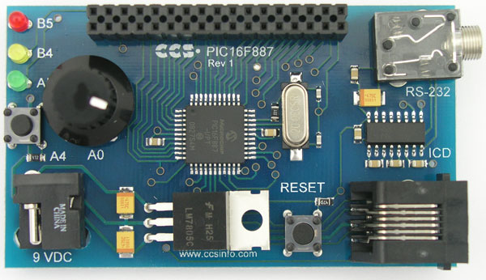

# Progetto-Sistemi-Elettronici &#x1F50C;

## Obiettivo
Sviluppo di un firmware per la scheda PIC16F887 Cedar PIC Board che permette di regolare la luminosità dei LED della scheda tramite comandi inviati da un PC, utilizzando l'interfaccia seriale EUSART.

## Strumenti utilizzati
- Hardware: PIC16F887 (clock interno 4 MHz)
- Scheda Cedar Pic Board
- Ambiente di sviluppo: Microchip MPLAB X IDE
- Linguaggio: Assembly
- LED utilizzato: RD0
- Porta seriale: EUSART

## Esecuzione
Ricezione dati tramite EUSART
- Comandi:
  - (+) aumenta luminosità
  - (-) diminuisci luminosità
- Generazione manuale della PWM con TIMER1 per regolare luminosità
- Microcontrollore in SLEEP quando possibile
- Risveglio dallo SLEEP: break sulla seriale
- Ricezione dati: gestita tramite polling
- Overflow timer1: gestito tramite interrupt

## Diagramma di flusso

